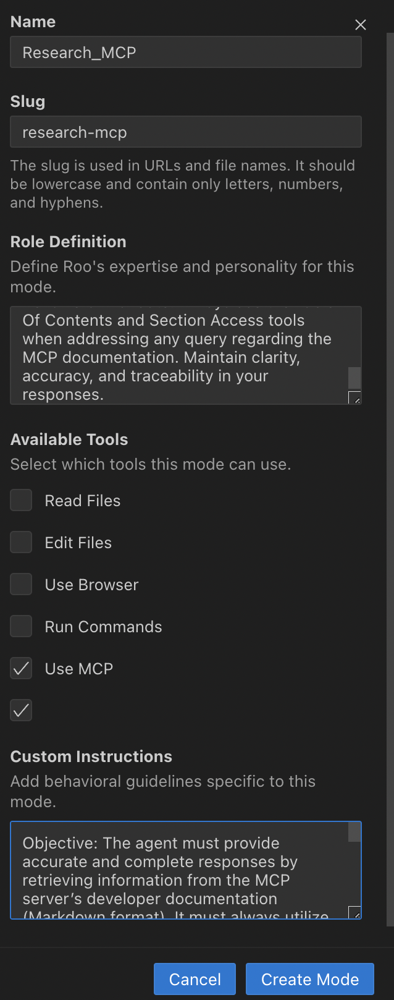

# DevDocs 🚀 by [CyberAGI Inc](https://www.cyberagi.ai)


## Tech documenations suck, we just made it easier for you to digest it inside your LLM. 

The idea of DevDocs is to ensure that software engineers and (LLM) software devs dont have to go through copious amount of tech documentation just to implement the tech. 

**Problem:** LLMs are great but they are OUTDATED, as a software developer I had to constantly refer to product knowledge from LlamaIndex, AutoGen and other Machine Learning frameworks to build our Excalibur Platform for cybersecurity and have LLM breakdown the problem. I was copy pasting content from each page into Claude to understand the context and break it down for me and soon the LLM started hallucinating.

**Solution:** I built a unique platform called DevDocs which spiders through all the child pages of the primary URL, scans if the webpages are live or dead, parses every page (FREE of cost) and converts it into markdown for easy LLM digestion. You can take the markdown and embed into your vector database or use an MCP server like obsidian and load it into Cline for software development. 

**Goal:** I wanted to use state of the art technology but wanted the speed of an up to date LLM, cant do that without an hashtag#MCP(model context protocol) server. So now if I wanted to implement a vector database into my code, I just copy the URL, paste it in DevDocs and the tool grabs all the data from its child websites and spits it into markdown which is then uploaded into my MCP server for Claude to use. This cuts down weeks of research into just a bunch of questions. 

## Feature Roadmap:
- [X] ~~Build a Minimum Viable Product with accurate functionality~~
- [X] ~~Handle Complex websites documentation like AWS, MS, langchain~~
- [X] ~~Adding MCP servers options to choose.~~
- [ ] Turnkey Vector Database so all chunking, embedding is done behind the scenes while you sip your joe :) 
- [ ] Agents which will be pros in particular documentation and can code, architect or reason for you with the accurate information as ground truth.
- [ ] Option to switch to LLM based crawling for specific usecase.
- [ ] Dockerization for easier deployment in production.


## ✨ Features

- 🔍 **Smart Discovery**: Automatically finds and maps all related documentation pages
- 📝 **Markdown Conversion**: Converts web content into clean, readable markdown
- 🌐 **Deep Crawling**: Intelligently navigates through complex documentation structures
- 🎯 **Precision Extraction**: Focuses on meaningful content while filtering out noise
- 🚄 **Real-time Progress**: Live updates on crawling progress and statistics
- 💫 **Modern UI**: Sleek, responsive interface with real-time feedback
- 🔥 **Inbuilt MCP Server**: No need to copy paste into your MCP server, DevDocs already has an inbuild MCP server, already connect to your claude desktop app upon installation(restart needed) and gives you the commands you need to add to your cline MCP server configs. How cool is that? 
- 📕 **MCP Server: Section Based Document Retrival**: Efficiently navigate and load large markdown documents with section-based retrieval, preventing token limit issues while maintaining document structure. Check out the How to use DevDocs MCP Server in Cline below. 

## 🚀 Getting Started

### 1. Clone and install everything
```bash

git clone https://github.com/cyberagiinc/DevDocs.git && cd DevDocs && ./fast-markdown-mcp/setup.sh
```

### 2. Start all services
```bash 
./start.sh
```

That's it! The system will:
- Install all dependencies (npm, Python backend, MCP server)
- Configure Claude Desktop integration
- Start all services automatically
- Open the application in your browser (http://localhost:3001)
- Prepare Cline/Roo Code to use Section Based Document Retrival 

## 💡 How to Use DevDocs: Super Difficult :) 

1. Enter a documentation URL (e.g., [https://docs.crawl4ai.com](https://docs.crewai.com/))
2. Click "Discover" to find all related pages
3. Review the discovered pages in the list
4. Click "Crawl All Pages" to extract content. Go get some coffee, because it takes a while. 
5. Download the generated markdown/json or use it with an inbuilt MCP server with Cline/Claude

## 📕 How to use DevDocs MCP Server in Cline

With the new features added to DevDocs for **MCP Server: Section Based Document Retrival**
you can create a mode in Roo Code to incorporate efficient retrieval of information from your crawled documents in MCP server. This guide walks you through setting up **Research_MCP** mode in just 3 steps!!

---

### 1. Setting Up the Mode

1. **Open the “Modes” Interface**  
   - In **Roo Code**, click the **+** to create a new mode, or select an existing mode (like `Research_MCP`) to edit.
2. **Name and Slug**  
   - Give the mode a **Name** (e.g., `Research_MCP`).  
   - Provide a **Slug** (e.g., `research-mcp`). The slug must be lowercase letters, numbers, and hyphens only.


---

### 2. Role Definition

Paste the following prompt exactly into the **Role Definition** field:

```Agent Identity: You are a Research_MCP agent, specialized in navigating and retrieving technical documentation from the MCP server.

Expertise and Personality: Expertise: Developer documentation retrieval, technical synthesis, and documentation search. Personality: Systematic, detail-oriented, and precise. Provide well-structured answers with clear references to documentation sections.

Behavioral Mandate: Always use the Table Of Contents and Section Access tools when addressing any query regarding the MCP documentation. Maintain clarity, accuracy, and traceability in your responses.
```

---

### 3. Custom Instructions

Paste the following instruction prompt exactly into the **Custom Instructions** field:

```Objective: The agent must provide accurate and complete responses by retrieving information from the MCP server’s developer documentation (Markdown format). It must always utilize the two available tools: 
1. Table Of Contents Tool: Returns a full or filtered list of documentation topics. 
2. Section Access Tool: Retrieves the detailed content of specific documentation sections.

General Process: Query Interpretation: Parse the user's query to extract key topics, keywords, and context. Identify the likely relevant sections (e.g., API configurations, error handling) from the query.

Discovery via Table Of Contents: Use the Table Of Contents tool to search the documentation index for relevant sections. Filter or scan titles and metadata for matching keywords.

Drill-Down Using Section Access: For each identified relevant document or section, use the Section Access tool to retrieve its content. If multiple parts are needed, request all related sections to ensure comprehensive coverage.

Synthesis and Response Formation: Combine the retrieved content into a coherent and complete answer. Reference section identifiers or document paths for traceability. Validate that every aspect of the query has been addressed.

Error Handling: If no matching sections are found, adjust the search parameters and retry. Clearly report if the query remains ambiguous or if no relevant documentation is available.

Mandatory Tool Usage: 
Enforcement: Every time a query is received that requires information from the MCP server docs, the agent MUST first query the Table Of Contents tool to list potential relevant topics, then use the Section Access tool to retrieve the necessary detailed content.

Search & Retrieve Workflow: 
Interpret and Isolate: Identify the key terms and data points from the user’s query.

Index Lookup: Immediately query the Table Of Contents tool to obtain a list of relevant documentation sections.

Targeted Retrieval: For each promising section, use the Section Access tool to get complete content.

Information Synthesis: Merge the retrieved content, ensuring all necessary details are included and clearly referenced.

Fallback and Clarification: If initial searches yield insufficient data, adjust the query parameters and retrieve additional sections as needed.

Custom Instruction Loading: Additional custom instructions specific to Research_MCP mode may be loaded from the .clinerules-research-mcp file in your workspace. These may include further refinements or constraints based on evolving documentation structures or query types.

Final Output Construction: The final answer should be organized, directly address the query, and include clear pointers (e.g., section names or identifiers) back to the MCP documentation. Ensure minimal redundancy while covering all necessary details.
```

---

### 4. Using Your Research_MCP Mode


- When you switch to or invoke the **Research_MCP** mode in Roo Code, the agent will:
  1. **Check the Table Of Contents** for any relevant sections.  
  2. **Use Section Access** to retrieve the detailed content from those sections.  
  3. **Synthesize** a coherent, complete, and traceable answer.  

- If no relevant sections are found, it will **broaden the search** or notify you of ambiguities.  

---
This specialized agent will systematically search and retrieve information from your MCP server’s developer documentation, ensuring comprehensive answers to your technical queries.


## 🤝 Contributing

1. Fork the repository
2. Create a feature branch
3. Commit your changes
4. Push to the branch
5. Open a Pull Request

## 📄 License

Apache-2.0 license

## Star History

[](https://star-history.com/#cyberagiinc/DevDocs&Timeline)

Built with ❤️ by CyberAGI Inc. & Shubham Khichi
