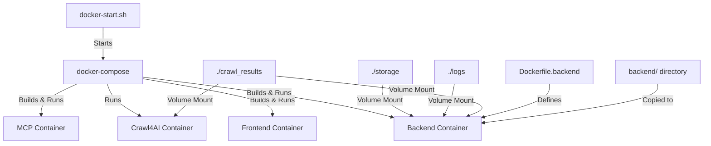

# Docker Implementation Plan for File Consolidation

## Overview

This document outlines the plan for implementing file consolidation changes in the DevDocs application when running with Docker.

## Current Docker Architecture



## Key Observations

1. The backend code is copied from the `backend/` directory into the Docker image during build time
2. The `storage/markdown`, `logs`, and `crawl_results` directories are mounted as volumes
3. Our file redirection changes are in `backend/app/crawler.py` and `backend/app/main.py`

## Implementation Challenges

1. **Volume Mounts**: Both `storage/markdown` and `crawl_results` are mounted as volumes, which means:
   - Files written to these directories are persisted on the host
   - The same directories are accessible from both the host and container

2. **Docker Image Rebuild**: When we modify the backend code, we need to ensure the Docker image is rebuilt to include our changes

## Implementation Plan

1. **Ensure Code Changes Are Preserved**:
   - Our changes to `backend/app/crawler.py` and `backend/app/main.py` will be included in the Docker image when it's built
   - No additional changes are needed to make this work with Docker

2. **Handle Volume Mounts**:
   - Our file redirection system will work correctly with the volume mounts
   - When files are redirected from `crawl_results` to `storage/markdown`, both directories are accessible in the container

3. **Docker Image Rebuild**:
   - When running `./docker-start.sh`, we need to ensure the Docker images are rebuilt to include our changes
   - This can be done by adding the `--build` flag to the `docker-compose up` command in `docker-start.sh`

4. **Modify docker-start.sh**:
   - Update the script to rebuild the Docker images when starting the containers

## Specific Changes Needed

1. **Modify docker-start.sh**:
```diff
- docker-compose up -d
+ docker-compose up -d --build
```

This change ensures that Docker rebuilds the images when starting the containers, incorporating our code changes.

## Verification Steps

1. Make our code changes to `backend/app/crawler.py` and `backend/app/main.py`
2. Update `docker-start.sh` to include the `--build` flag
3. Run `./docker-start.sh`
4. Test the application by crawling a URL
5. Verify that:
   - No individual files are created in `crawl_results`
   - All content is consolidated in `storage/markdown`

## Advantages of This Approach

1. **Minimal Changes**: We only need to modify one line in `docker-start.sh`
2. **Preserves Docker Setup**: The existing Docker architecture remains unchanged
3. **Consistent Behavior**: The application will behave the same way in Docker as it does when run directly