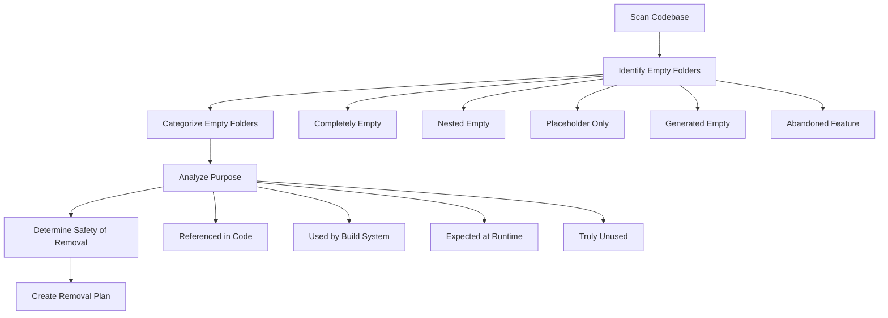

# Empty Folders Cleanup Plan

## Overview

This document outlines a plan to identify and clean up empty "ghost" folders in the codebase that serve no purpose. These folders can accumulate over time due to various reasons such as abandoned features, incomplete refactoring, or temporary development structures that were never removed.

## Types of Empty Folders

We need to identify several types of potentially unnecessary folders:

1. **Completely Empty Folders**: Directories with no files or subdirectories
2. **Nested Empty Folders**: Directories that contain only empty subdirectories
3. **Placeholder Folders**: Directories with only placeholder files (e.g., `.gitkeep`, empty `.gitignore`)
4. **Generated Empty Folders**: Directories created by build tools but not used
5. **Abandoned Feature Folders**: Directories for features that were started but abandoned

## Identification Process



### Step 1: Scan the Codebase

Create a script to scan the codebase and identify potentially empty folders:

```bash
#!/bin/bash

# Find completely empty directories
echo "Finding completely empty directories..."
find . -type d -empty -not -path "*/node_modules/*" -not -path "*/\.*" > empty_dirs.txt

# Find directories with only .gitkeep files
echo "Finding directories with only placeholder files..."
find . -type d -not -path "*/node_modules/*" -not -path "*/\.*" | while read dir; do
  # Count non-hidden files
  file_count=$(find "$dir" -maxdepth 1 -type f -not -name ".*" | wc -l)
  # Count .gitkeep files
  gitkeep_count=$(find "$dir" -maxdepth 1 -type f -name ".gitkeep" | wc -l)
  
  # If the only file is .gitkeep
  if [ "$file_count" -eq 0 ] && [ "$gitkeep_count" -eq 1 ]; then
    echo "$dir" >> placeholder_dirs.txt
  fi
done

# Find nested empty directories
echo "Finding nested empty directories..."
find . -type d -not -path "*/node_modules/*" -not -path "*/\.*" | while read dir; do
  # Check if directory contains only empty subdirectories
  if [ -n "$(find "$dir" -mindepth 1 -maxdepth 1 -type d)" ] && [ -z "$(find "$dir" -mindepth 1 -type f)" ]; then
    empty_subdirs=true
    for subdir in $(find "$dir" -mindepth 1 -maxdepth 1 -type d); do
      if [ -n "$(find "$subdir" -mindepth 1)" ]; then
        empty_subdirs=false
        break
      fi
    done
    
    if [ "$empty_subdirs" = true ]; then
      echo "$dir" >> nested_empty_dirs.txt
    fi
  fi
done

echo "Results saved to empty_dirs.txt, placeholder_dirs.txt, and nested_empty_dirs.txt"
```

### Step 2: Analyze Purpose

For each identified empty folder, analyze its purpose:

1. **Check for References in Code**:
   ```bash
   grep -r "folder_name" --include="*.{js,ts,tsx,jsx,json,md}" .
   ```

2. **Check Build Configuration**:
   - Review webpack, babel, and other build tool configurations
   - Check package.json scripts

3. **Check Runtime Requirements**:
   - Review server configurations
   - Check for dynamic path generation in code

### Step 3: Categorize and Document

Create a spreadsheet or markdown table with the following columns:
- Folder Path
- Type (Empty/Nested Empty/Placeholder/Generated/Abandoned)
- Referenced In (Code/Build/Runtime/None)
- Recommendation (Remove/Keep)
- Justification
- Risk Level (Low/Medium/High)

## Analysis Criteria

When determining whether a folder can be safely removed, consider:

1. **Is it referenced in code?**
   - Direct path references
   - Import statements
   - Configuration files

2. **Is it used by the build system?**
   - Output directories
   - Temporary build directories
   - Asset directories

3. **Is it expected at runtime?**
   - Directories created dynamically
   - Upload directories
   - Cache directories

4. **Is it part of a convention?**
   - Standard directory structures
   - Framework expectations

## Cleanup Process

### For Safe Removal (Low Risk)

1. Create a script to remove identified folders:
   ```bash
   #!/bin/bash
   
   # Read from the safe_to_remove.txt file
   while read folder; do
     echo "Removing: $folder"
     rm -rf "$folder"
   done < safe_to_remove.txt
   ```

2. Run the script in a test environment first

3. Verify application still works after removal

### For Medium Risk Folders

1. Create a backup before removal
2. Remove folders one at a time
3. Test thoroughly after each removal
4. Be prepared to restore if issues arise

### For High Risk Folders

1. Consider keeping with documentation explaining why
2. If removal is necessary, implement with feature flags
3. Deploy changes gradually with monitoring

## Prevention Measures

To prevent accumulation of empty folders in the future:

1. **Add Git Hooks**:
   ```bash
   #!/bin/bash
   
   # Pre-commit hook to detect empty directories being added
   empty_dirs=$(find . -type d -empty -not -path "*/node_modules/*" -not -path "*/\.*")
   
   if [ -n "$empty_dirs" ]; then
     echo "Warning: You're about to commit empty directories:"
     echo "$empty_dirs"
     echo "Consider adding content or removing them."
     exit 1
   fi
   ```

2. **Regular Cleanup**:
   - Schedule quarterly codebase cleanup sessions
   - Include empty folder detection in code reviews

3. **Documentation**:
   - Document intentionally empty folders with README files explaining their purpose
   - Use .gitkeep only when the folder is truly needed but intentionally empty

## Implementation Plan

### Phase 1: Identification and Analysis

1. Run the identification script
2. Analyze and categorize results
3. Create a detailed inventory of empty folders
4. Determine which folders can be safely removed

### Phase 2: Low-Risk Cleanup

1. Remove completely empty folders with no references
2. Remove nested empty folders with no references
3. Test application functionality

### Phase 3: Medium-Risk Cleanup

1. Remove placeholder-only folders not required by convention
2. Remove abandoned feature folders
3. Test application functionality

### Phase 4: Documentation and Prevention

1. Document any intentionally empty folders that were kept
2. Implement prevention measures
3. Create guidelines for future development

## Success Metrics

- Number of empty folders removed
- Reduction in codebase size
- Improved build times (if applicable)
- Cleaner project structure

## Next Steps

1. Create and run the identification script
2. Review and categorize the results
3. Develop a detailed implementation plan
4. Begin with removing low-risk empty folders