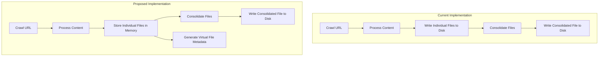

# In-Memory File Processing Plan

Based on your requirements, I'll create a plan to keep individual files in memory while only writing consolidated files to disk. This will reduce clutter in the storage/markdown directory while maintaining all functionality.

## Current vs. Proposed Architecture



## Key Changes Required

1. **In-Memory File Storage**:
   - Create an in-memory storage system for individual files
   - Implement a virtual file system that mimics the behavior of real files

2. **File Redirection**:
   - Modify the file redirection system to intercept writes to individual files
   - Store the content in memory instead of writing to disk

3. **Metadata Handling**:
   - Maintain the current metadata structure
   - Generate metadata for virtual files that aren't actually on disk

4. **UI Integration**:
   - Ensure the StoredFiles component can display both real and virtual files

## Detailed Implementation Plan

### 1. Create In-Memory Storage System

```python
# Create a global in-memory storage for file content
in_memory_files = {}
```

### 2. Modify File Redirection System

We'll need to modify the file redirection system in `backend/app/crawler.py` to:
- Intercept writes to individual files
- Store the content in memory
- Only write consolidated files to disk

```python
# Pseudo-code for the modified file redirection
def redirecting_open(file, mode='r', *args, **kwargs):
    if 'w' in mode and is_individual_file(file):
        # Return a memory file object instead of a real file
        return MemoryFileObject(file)
    elif 'w' in mode and is_consolidated_file(file):
        # Allow writes to consolidated files
        return original_open(file, mode, *args, **kwargs)
    else:
        # For read operations, check if file exists in memory first
        if is_individual_file(file) and file in in_memory_files:
            return MemoryFileObject(file)
        return original_open(file, mode, *args, **kwargs)
```

### 3. Implement Memory File Object

```python
class MemoryFileObject:
    def __init__(self, filename):
        self.filename = filename
        self.buffer = []
        
    def write(self, content):
        self.buffer.append(content)
        
    def close(self):
        # Store the content in memory
        in_memory_files[self.filename] = {
            'content': ''.join(self.buffer),
            'timestamp': datetime.now().isoformat()
        }
        
        # If this is a JSON file, parse and store metadata
        if self.filename.endswith('.json'):
            try:
                metadata = json.loads(''.join(self.buffer))
                in_memory_files[self.filename]['metadata'] = metadata
            except:
                pass
                
    def __enter__(self):
        return self
        
    def __exit__(self, *args):
        self.close()
```

### 4. Modify API Endpoints

We'll need to modify the API endpoints that list and retrieve files to include both real and virtual files:

```python
@app.get("/api/storage/list")
async def list_files():
    # Get real files from disk
    real_files = get_files_from_disk()
    
    # Add virtual files from memory
    virtual_files = get_files_from_memory()
    
    # Combine and return
    return real_files + virtual_files
```

### 5. Update File Reading Logic

```python
@app.get("/api/storage/file/{file_id}")
async def get_file(file_id: str):
    # Check if file exists in memory
    if file_id in in_memory_files:
        return in_memory_files[file_id]['content']
    
    # Otherwise read from disk
    file_path = f"storage/markdown/{file_id}"
    if os.path.exists(file_path):
        with open(file_path, 'r') as f:
            return f.read()
    
    return {"error": "File not found"}
```

## Implementation Challenges

1. **Memory Management**: We need to be careful about memory usage, especially for large crawls
2. **Persistence**: In-memory files will be lost when the server restarts
3. **Concurrency**: Need to handle concurrent access to in-memory files

## Advantages

1. **Reduced Disk Clutter**: Only consolidated files are written to disk
2. **Maintained Functionality**: All features continue to work as before
3. **Improved Performance**: In-memory operations are faster than disk I/O

## Verification Steps

1. Modify the code according to the plan
2. Run the application with Docker
3. Test by crawling a URL
4. Verify that:
   - No individual files are created in the storage/markdown directory
   - Consolidated files are correctly written to disk
   - The UI shows both individual and consolidated files