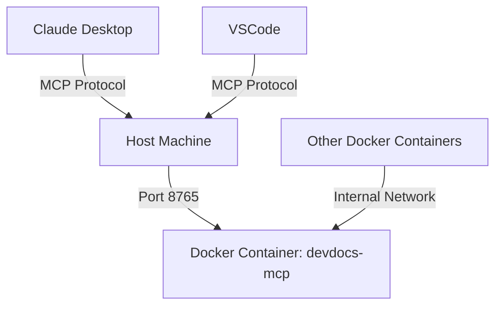

# Docker MCP Server Integration Plan

## Current Situation

Currently, the MCP server is running inside a Docker container (`devdocs-mcp`) but is not accessible from the host machine. The Claude desktop app and VSCode need to access this MCP server directly.

### Current Configuration

1. **MCP Server in Docker**: Running in the `devdocs-mcp` container
2. **Current MCP Settings**: 
   ```json
   {
     "mcpServers": {
       "fast-markdown": {
         "command": "/Users/shubhamkhichi/Documents/GitHub/DevDocs/fast-markdown-mcp/venv/bin/python",
         "args": [
           "-m",
           "fast_markdown_mcp.server",
           "/Users/shubhamkhichi/Documents/GitHub/DevDocs/storage/markdown"
         ],
         "env": {
           "PYTHONPATH": "/Users/shubhamkhichi/Documents/GitHub/DevDocs/fast-markdown-mcp/src"
         },
         "alwaysAllow": [
           "sync_file"
         ]
       }
     }
   }
   ```
3. **Error in MCP Container**: `I/O operation on closed file`
4. **Backend Container**: Successfully connects to MCP container via internal Docker network

## Implementation Plan



### Step 1: Expose MCP Server Port in Docker Compose

We need to modify the `docker-compose.yml` file to expose the MCP server port to the host machine:

```yaml
mcp:
  build:
    context: .
    dockerfile: Dockerfile.mcp
  container_name: devdocs-mcp
  ports:
    - "8765:8765"  # Expose port 8765 to the host
  volumes:
    - ./storage/markdown:/app/storage/markdown
    - ./logs:/app/logs
  networks:
    - devdocs-network
  restart: unless-stopped
```

### Step 2: Ensure MCP Server Listens on All Interfaces

The MCP server needs to be configured to listen on all network interfaces (0.0.0.0) instead of just localhost. This allows connections from outside the container.

### Step 3: Create MCP Health Check Script

Create a script to verify the MCP server is accessible and functioning correctly:

```bash
#!/bin/bash

# Colors for output
GREEN='\033[0;32m'
RED='\033[0;31m'
BLUE='\033[0;34m'
NC='\033[0m' # No Color

echo -e "${BLUE}Checking MCP server health...${NC}"

# Check if Docker is running
if ! docker info &>/dev/null; then
  echo -e "${RED}Docker is not running. Please start Docker first.${NC}"
  exit 1
fi

# Check if MCP container is running
if ! docker ps | grep -q devdocs-mcp; then
  echo -e "${RED}MCP container is not running.${NC}"
  echo -e "Try running: ${BLUE}./docker-start.sh${NC}"
  exit 1
fi

# Check if port 8765 is exposed and listening
if ! docker exec devdocs-mcp netstat -tuln | grep -q "8765"; then
  echo -e "${RED}MCP server is not listening on port 8765 inside the container.${NC}"
  echo -e "Container logs:"
  docker logs devdocs-mcp --tail 20
  exit 1
fi

# Check if port is accessible from host
if ! nc -z localhost 8765 &>/dev/null; then
  echo -e "${RED}MCP server port 8765 is not accessible from host.${NC}"
  echo -e "Check docker-compose.yml for proper port mapping."
  exit 1
fi

echo -e "${GREEN}MCP server is healthy and accessible on port 8765.${NC}"
echo -e "You can now configure Claude and VSCode to use the MCP server."
```

### Step 4: Update Claude MCP Settings

Update the Claude configuration file to use the Docker-exposed MCP server:

```json
{
  "mcpServers": {
    "fast-markdown": {
      "command": "nc",
      "args": ["localhost", "8765"],
      "env": {},
      "disabled": false,
      "alwaysAllow": ["sync_file"]
    }
  }
}
```

Alternatively, if direct port access doesn't work, we can use Docker exec:

```json
{
  "mcpServers": {
    "fast-markdown": {
      "command": "docker",
      "args": ["exec", "-i", "devdocs-mcp", "python", "-m", "fast_markdown_mcp.server", "/app/storage/markdown"],
      "env": {},
      "disabled": false,
      "alwaysAllow": ["sync_file"]
    }
  }
}
```

### Step 5: Troubleshooting the "I/O operation on closed file" Error

This error typically occurs when:
1. The MCP server is trying to read from stdin after it's been closed
2. There's an issue with file descriptors in the Docker container

Solutions:
1. Ensure the Docker container is configured with `stdin_open: true` and `tty: true`
2. Add proper error handling in the server code for I/O operations
3. Check if the server is properly handling stdin/stdout communication

## Implementation Details

### Docker Compose Changes

Add the following to the MCP service in docker-compose.yml:

```yaml
ports:
  - "8765:8765"
stdin_open: true
tty: true
```

### MCP Server Configuration

Ensure the MCP server is binding to 0.0.0.0 instead of localhost. This might require modifying the server code or adding environment variables.

### Testing Procedure

1. **Rebuild and restart Docker containers**:
   ```bash
   docker-compose down
   docker-compose up -d --build
   ```

2. **Run the health check script**:
   ```bash
   ./check_mcp_health.sh
   ```

3. **Test Claude integration**:
   - Update Claude's MCP settings
   - Test basic functionality to ensure Claude can communicate with the server

## Potential Issues and Solutions

| Issue | Solution |
|-------|----------|
| Port 8765 already in use | Change to a different port in docker-compose.yml |
| MCP server not binding to all interfaces | Modify server code to listen on 0.0.0.0 |
| I/O operation errors | Add stdin_open and tty flags to Docker configuration |
| Connection refused | Check firewall settings and Docker network configuration |
| Permission issues | Ensure proper file permissions for volumes |

## Conclusion

By following this implementation plan, we will expose the MCP server running in a Docker container to the host machine, allowing Claude and VSCode to access it directly. This approach maintains the isolation benefits of Docker while providing the necessary connectivity for external tools.